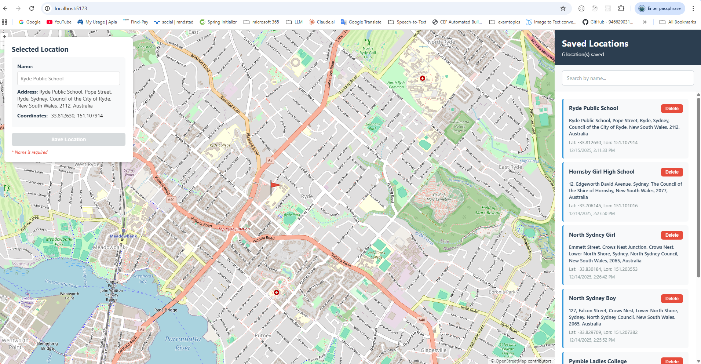

# Map Location Tracker

A professional web-based map application built with Vue.js, Vuex, OpenLayers, and SQLite for tracking and managing location data.

## Features

- **Interactive 2D Street Map**: Built with OpenLayers for smooth navigation
- **Location Selection**: Click anywhere on the map to select a location
- **Reverse Geocoding**: Automatically fetches address information
- **Persistent Storage**: SQLite database stores all selected locations
- **Location History**: View, manage, and delete past locations
- **Responsive Design**: Works on desktop and mobile devices
- **Real-time Updates**: Vuex state management for reactive UI

## Tech Stack

- **Frontend**: Vue.js 3, Vuex 4, OpenLayers 8, Vite
- **Backend**: Java SDK 17, Spring Boot 3.2.0, RESTful API
- **Database**: SQLite3
- **Map Data**: OpenStreetMap

## Installation

### Prerequisites
- Java SDK 17 or higher
- Node.js (v14 or higher)
- npm or yarn

### Setup Steps

1. **Clone project directory**
   ```bash
   git clone https://github.com/linaizhong/osm-map-location-tracker.git
   cd Your_Git_Path/osm-map-location-tracker
   ```

2. **If you are using the NodeJS server, you can install backend dependencies, build and run the server**
   ```bash
   cd nodejs-backend
   npm install express sqlite3 cors body-parser
   node server.js   
   ```

3. **Alternatively, if you are using the Java server, you can install backend dependencies, build and run the server**
   ```bash
   cd backend 
   mvn clean install
   java -jar .\target\map-location-tracker-1.0.0.jar   
   ```

4. **In a new terminal, install frontend dependencies and run it**
   ```bash
   cd frontend 
   npm install
   npm run dev
   ```

5. **Access the application**
   - The frontend will open automatically (usually `http://localhost:5173`)
   - Backend API runs on `http://localhost:3000`

### Screenshot

 